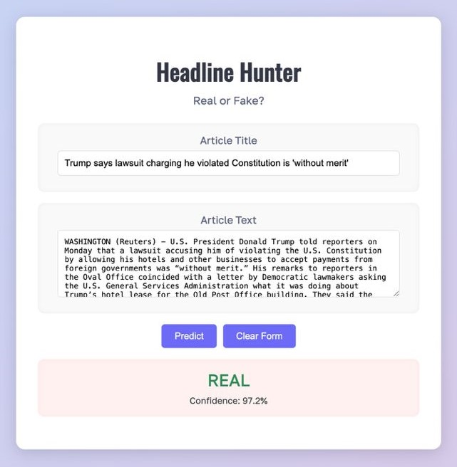

# Headline Hunter: Fake News Detection




A web-based fake news detection interface built for our MSML606 project at the University of Maryland. This project compares three approaches:

- 🧠 **Data Structure-Based Model (DSA + Random Forest)**
- ✍️ **TF-IDF + Random Forest**
- 🦾 **BERT Fine-Tuned Model (HuggingFace Transformers)**

The goal is to evaluate interpretability, runtime efficiency, and scalability of traditional algorithmic NLP approaches vs modern deep learning models.

## 🔍 Project Overview

Fake news poses serious risks in digital communication. This project evaluates:

- **Efficiency and explainability** of classical DSA features (e.g. HashMaps, Heaps, Sets, Tries)
- **Performance trade-offs** of TF-IDF and BERT
- **Scalability and real-time feasibility** for edge devices

## 💡 Key Features

- Eight handcrafted features using data structures (e.g. Jaccard similarity, word frequency, punctuation)
- Interactive Flask-based web UI: **Headline Hunter**
- Confidence score and model output shown on-screen
- DSA RF model enabled by default in the interface
- Multi-model toggle feature to switch between DSA RF, TF-IDF RF, and BERT
- Clean, animated UI with color-coded results

## 📊 Results Summary (from MSML606_Report.pdf)

| Model   | Accuracy | F1 Score | Training Time  | Inference Time | Model Size |
|---------|----------|----------|----------------|----------------|------------|
| DSA RF  | 91.02%   | 92.11%   | 1.94 sec       | 0.000008 sec   | 10.32 MB   |
| TF-IDF  | 95.97%   | 96.32%   | 5.06 sec       | 0.000016 sec   | 5.01 MB    |
| BERT    | 97.95%   | 98.09%   | N/A            | 0.1171 sec     | 437.96 MB  |

## 🖼 Sample UI Screenshots


## 🖥 Interface Preview

- Allows input of title and text
- Predicts Real / Fake with confidence score
- Works entirely locally via Flask backend

## 🗂 Folder Structure

```
├── app.py                 # Flask app logic
├── model/                 # Saved models: DSA RF, TF-IDF RF, BERT
├── templates/
│   └── index.html         # UI template with model selector
├── static/
│   └── style.css          # UI styling and animations
├── assets/                # UI screenshots and demo images
│   ├── demo-real.jpg
│   └── demo-fake.jpg
├── data/
│   ├── train.csv          # Kaggle training data
│   ├── test.csv
│   └── evaluation.csv
├── MSML606.ipynb          # Notebook with training and experiments
└── README.md
```

## 🧪 How to Run Locally

```bash
# 1. Clone repo
https://github.com/ani14kay/Headline-Hunter

# 2. Setup environment
python3 -m venv venv
source venv/bin/activate
pip install -r requirements.txt

# 3. Train models (optional)
Run `MSML606.ipynb`

# 4. Start the app
python app.py

# Open in browser: http://127.0.0.1:5000
```

## 👩‍💻 Contributions

This project was developed by Yatish Sikka, Nikita Miller, Aariz Faridi, and Anisha Katiyar for MSML606. All model implementations, experiments, and UI designs were done from scratch.

## 📚 Dataset
[Kaggle Fake News Classification Dataset](https://www.kaggle.com/datasets/aadyasingh55/fake-news-classification)

## 📌 Acknowledgements
- HuggingFace Transformers
- Scikit-learn
- Flask

---

For detailed architecture and results, see our [MSML606_Report.pdf](MSML606_Report.pdf).